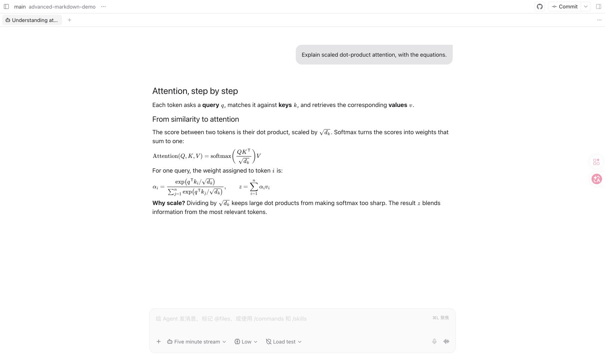
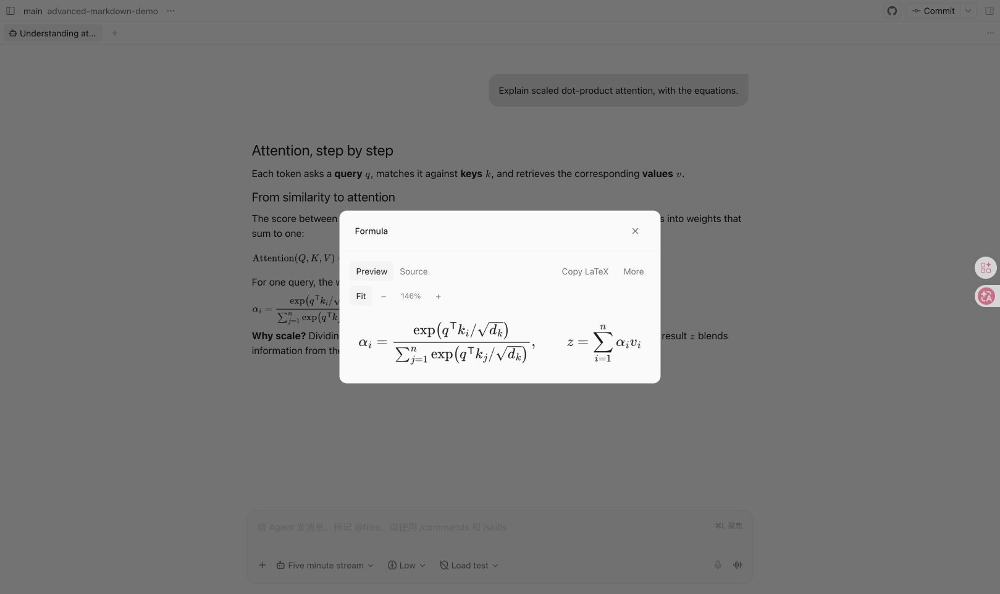
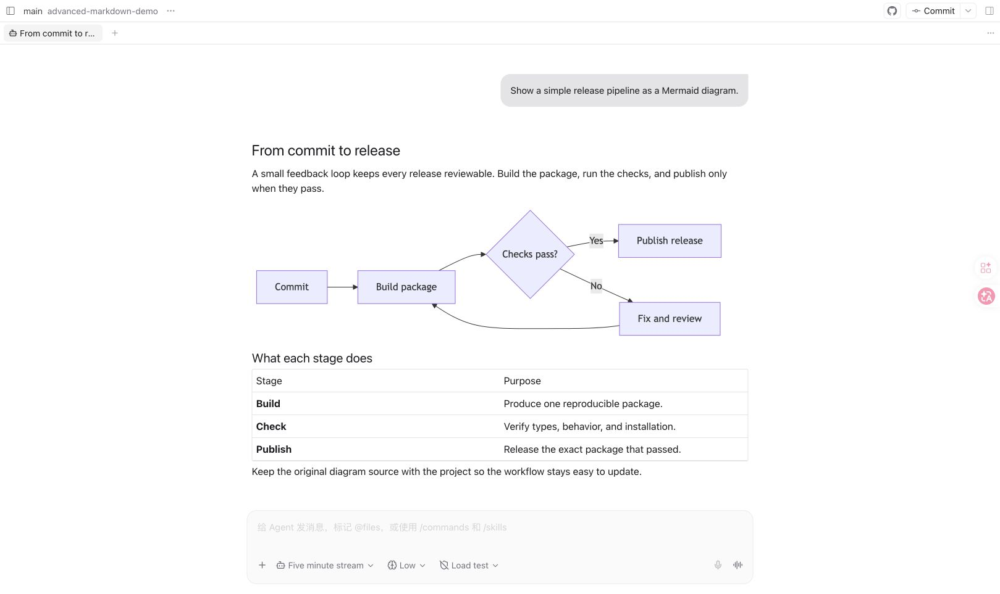

# Advanced Markdown for Paseo

Math formulas and Mermaid diagrams, rendered directly in your
[Paseo](https://paseo.sh) assistant messages.

[Install](#install) · [Plugin catalog](https://paseo.cafe/plugins/advanced-markdown) ·
[npm](https://www.npmjs.com/package/paseo-advanced-markdown) ·
[Release notes](https://github.com/custyhs/paseo-advanced-markdown/releases)

- **Read math and diagrams** alongside text, tables, code, and local file links.
- **Click to inspect** a formula or diagram, zoom in, view its source, and copy it.
- **Keep rendering local** on your Paseo daemon host, with light and dark themes.
- **Optional code and table handling** keeps folder trees from wrapping and wide
  tables from squeezing into unreadable columns on narrow screens.



<details>
<summary>More screenshots: formula viewer and Mermaid diagrams</summary>





Screenshots use sample conversations in the official Paseo 0.9.0-beta.2 web client.

</details>

## Install

Requires **Paseo 0.8–0.11** on both app and daemon (`>=0.8.0 <0.12.0`).
The daemon host needs Node ≥ 22.22, npm, Git, internet access for installation,
and about 700 MiB for the rendering cache.

Enable plugins in **Settings → Plugins**, then run:

```bash
paseo plugin add custyhs/paseo-advanced-markdown --ref v0.2.6
paseo plugin ls
```

Paseo prepares the rendering dependencies automatically. For an existing Git
installation with `--ref` support:

```bash
paseo plugin update advanced-markdown --ref v0.2.6
```

A pinned tag stays on that release until you select a newer tag.
See the [installation guide](https://github.com/custyhs/paseo-advanced-markdown/blob/main/docs/installation.md)
for Linux setup, local checkouts, rollback, and troubleshooting.

## Use

Formulas in `$…$`, `\(…\)`, `$$…$$`, `\[…\]`, or `math` fences render automatically;
`mermaid` fences render as diagrams.

Click or tap a formula or diagram to open its viewer. Use **Preview** to zoom and
copy LaTeX or Mermaid; use **Source** to copy Markdown. On desktop, drag long
formulas and overflowing code blocks horizontally. Local file links open a
read-only preview.

Turn on **Code blocks** and **Tables** (off by default) to also render ordinary
fenced code and Markdown tables through the plugin, so long lines scroll instead
of wrapping and wide tables stay readable on phones.

Change text size, formula size, and enabled modules in
**Settings → Plugins → Advanced Markdown**.

## Compatibility and details

The latest release was tested with official **Paseo 0.11.0-beta.3**, including
web layouts at desktop and phone widths. This release has no new iOS/Android
device validation; Windows is untested.

- [Usage and limits](https://github.com/custyhs/paseo-advanced-markdown/blob/main/docs/usage.md) — supported content, viewer behavior, and rendering limits.
- [Development and packaging](https://github.com/custyhs/paseo-advanced-markdown/blob/main/docs/development.md) — local setup, compatibility checks, and release tooling.
- [Report an issue](https://github.com/custyhs/paseo-advanced-markdown/issues) — include your Paseo version, platform, and a sample that reproduces the problem.

Licensed under [Apache-2.0](LICENSE). See [NOTICE](NOTICE) for attribution.
