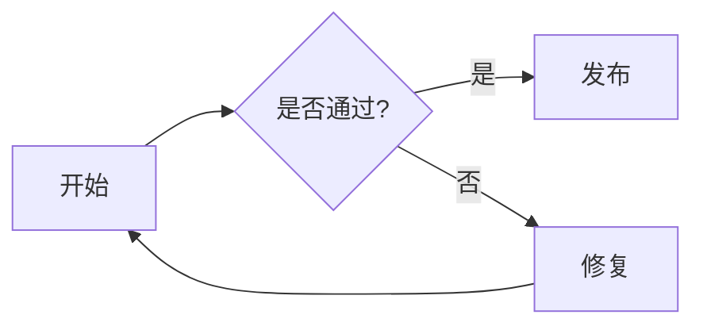

# Advanced Markdown smoke

Inline math like $E = mc^2$ and \(a^2 + b^2 = c^2\) sits in **bold prose**. Prices such as $5 and $10 stay text, and `$x$` in code is untouched.

$$
\int_0^1 x^2 \, dx = \frac{1}{3}
$$

```math
\begin{aligned}
\nabla \cdot \mathbf{E} &= \frac{\rho}{\varepsilon_0} \\

\nabla \cdot \mathbf{B} &= 0
\end{aligned}
```



| Symbol | Meaning |
| --- | --- |
| $\alpha$ | learning rate |
| $\beta$ | momentum |

```python
price = "$5 + $10"
```

- A list item with a [link](https://example.org) and \[ \sum_{i=1}^{n} i \]
