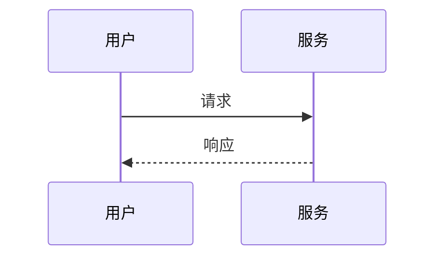
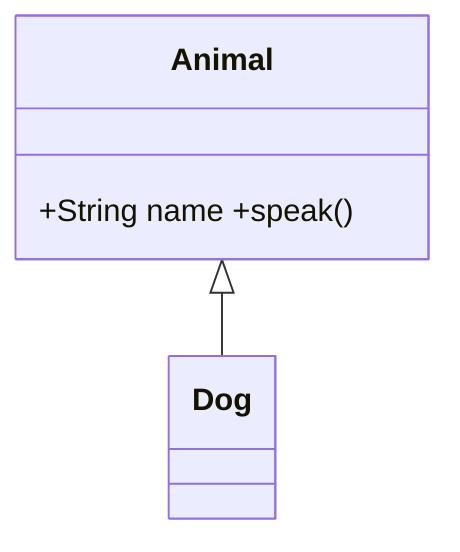
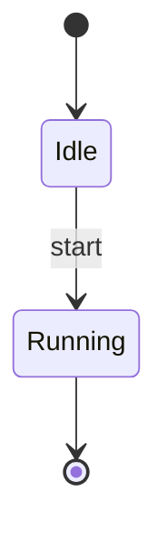
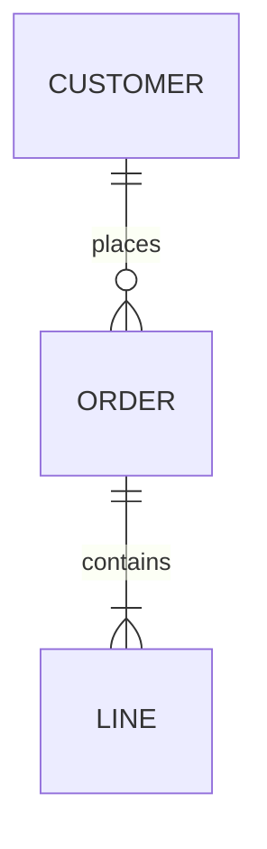
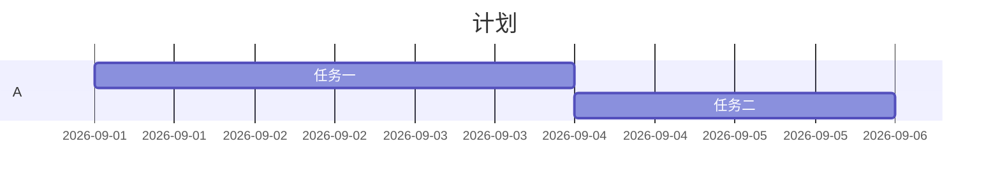
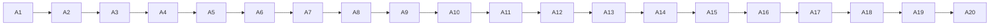

# Full spec pass

> A quote with inline math $\lim_{x \to 0} \frac{\sin x}{x} = 1$ and **emphasis**.

1. Ordered item with $\vec{v} \cdot \vec{w}$
2. Second item with a very long formula:

$$
f(x) = \sum_{n=0}^{\infty} \frac{f^{(n)}(a)}{n!}(x-a)^n + \int_{-\infty}^{\infty} e^{-t^2}\,dt \cdot \prod_{k=1}^{m} \left(1 + \frac{\lambda_k}{\mu_k}\right) - \oint_{\partial \Omega} \mathbf{F} \cdot d\mathbf{S} + \lim_{N \to \infty} \frac{1}{N}\sum_{i=1}^{N} X_i^2
$$

Invalid TeX stays readable: $\unknowncommand{x}$ next to valid $\alpha + \beta$.













```mermaid
flowchart LR
  this is not valid mermaid --> [[[
```

Currency $12.50 and $3 stay text; `inline $code$` stays code.

```math
\begin{pmatrix} a & b \\ c & d \end{pmatrix}
```
