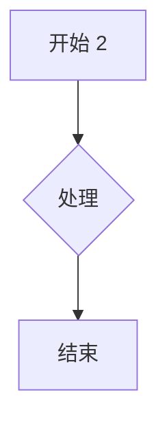

# Load sample

Fifty formulas and five diagrams follow.

1. Inline $x_{1}^2 + y_{1}$ and display:

$$\frac{\partial L}{\partial \theta_{1}} = \sum_{j=1}^{1} w_j \phi_j(x)$$

2. Inline $x_{2}^2 + y_{2}$ and display:

$$\frac{\partial L}{\partial \theta_{2}} = \sum_{j=1}^{2} w_j \phi_j(x)$$

3. Inline $x_{3}^2 + y_{3}$ and display:

$$\frac{\partial L}{\partial \theta_{3}} = \sum_{j=1}^{3} w_j \phi_j(x)$$

4. Inline $x_{4}^2 + y_{4}$ and display:

$$\frac{\partial L}{\partial \theta_{4}} = \sum_{j=1}^{4} w_j \phi_j(x)$$

5. Inline $x_{5}^2 + y_{5}$ and display:

$$\frac{\partial L}{\partial \theta_{5}} = \sum_{j=1}^{5} w_j \phi_j(x)$$

6. Inline $x_{6}^2 + y_{6}$ and display:

$$\frac{\partial L}{\partial \theta_{6}} = \sum_{j=1}^{6} w_j \phi_j(x)$$

7. Inline $x_{7}^2 + y_{7}$ and display:

$$\frac{\partial L}{\partial \theta_{7}} = \sum_{j=1}^{7} w_j \phi_j(x)$$

8. Inline $x_{8}^2 + y_{8}$ and display:

$$\frac{\partial L}{\partial \theta_{8}} = \sum_{j=1}^{8} w_j \phi_j(x)$$

9. Inline $x_{9}^2 + y_{9}$ and display:

$$\frac{\partial L}{\partial \theta_{9}} = \sum_{j=1}^{9} w_j \phi_j(x)$$

10. Inline $x_{10}^2 + y_{10}$ and display:

$$\frac{\partial L}{\partial \theta_{10}} = \sum_{j=1}^{10} w_j \phi_j(x)$$

11. Inline $x_{11}^2 + y_{11}$ and display:

$$\frac{\partial L}{\partial \theta_{11}} = \sum_{j=1}^{11} w_j \phi_j(x)$$

12. Inline $x_{12}^2 + y_{12}$ and display:

$$\frac{\partial L}{\partial \theta_{12}} = \sum_{j=1}^{12} w_j \phi_j(x)$$

13. Inline $x_{13}^2 + y_{13}$ and display:

$$\frac{\partial L}{\partial \theta_{13}} = \sum_{j=1}^{13} w_j \phi_j(x)$$

14. Inline $x_{14}^2 + y_{14}$ and display:

$$\frac{\partial L}{\partial \theta_{14}} = \sum_{j=1}^{14} w_j \phi_j(x)$$

15. Inline $x_{15}^2 + y_{15}$ and display:

$$\frac{\partial L}{\partial \theta_{15}} = \sum_{j=1}^{15} w_j \phi_j(x)$$

16. Inline $x_{16}^2 + y_{16}$ and display:

$$\frac{\partial L}{\partial \theta_{16}} = \sum_{j=1}^{16} w_j \phi_j(x)$$

17. Inline $x_{17}^2 + y_{17}$ and display:

$$\frac{\partial L}{\partial \theta_{17}} = \sum_{j=1}^{17} w_j \phi_j(x)$$

18. Inline $x_{18}^2 + y_{18}$ and display:

$$\frac{\partial L}{\partial \theta_{18}} = \sum_{j=1}^{18} w_j \phi_j(x)$$

19. Inline $x_{19}^2 + y_{19}$ and display:

$$\frac{\partial L}{\partial \theta_{19}} = \sum_{j=1}^{19} w_j \phi_j(x)$$

20. Inline $x_{20}^2 + y_{20}$ and display:

$$\frac{\partial L}{\partial \theta_{20}} = \sum_{j=1}^{20} w_j \phi_j(x)$$

21. Inline $x_{21}^2 + y_{21}$ and display:

$$\frac{\partial L}{\partial \theta_{21}} = \sum_{j=1}^{21} w_j \phi_j(x)$$

22. Inline $x_{22}^2 + y_{22}$ and display:

$$\frac{\partial L}{\partial \theta_{22}} = \sum_{j=1}^{22} w_j \phi_j(x)$$

23. Inline $x_{23}^2 + y_{23}$ and display:

$$\frac{\partial L}{\partial \theta_{23}} = \sum_{j=1}^{23} w_j \phi_j(x)$$

24. Inline $x_{24}^2 + y_{24}$ and display:

$$\frac{\partial L}{\partial \theta_{24}} = \sum_{j=1}^{24} w_j \phi_j(x)$$

25. Inline $x_{25}^2 + y_{25}$ and display:

$$\frac{\partial L}{\partial \theta_{25}} = \sum_{j=1}^{25} w_j \phi_j(x)$$

26. Inline $x_{26}^2 + y_{26}$ and display:

$$\frac{\partial L}{\partial \theta_{26}} = \sum_{j=1}^{26} w_j \phi_j(x)$$

27. Inline $x_{27}^2 + y_{27}$ and display:

$$\frac{\partial L}{\partial \theta_{27}} = \sum_{j=1}^{27} w_j \phi_j(x)$$

28. Inline $x_{28}^2 + y_{28}$ and display:

$$\frac{\partial L}{\partial \theta_{28}} = \sum_{j=1}^{28} w_j \phi_j(x)$$

29. Inline $x_{29}^2 + y_{29}$ and display:

$$\frac{\partial L}{\partial \theta_{29}} = \sum_{j=1}^{29} w_j \phi_j(x)$$

30. Inline $x_{30}^2 + y_{30}$ and display:

$$\frac{\partial L}{\partial \theta_{30}} = \sum_{j=1}^{30} w_j \phi_j(x)$$

31. Inline $x_{31}^2 + y_{31}$ and display:

$$\frac{\partial L}{\partial \theta_{31}} = \sum_{j=1}^{31} w_j \phi_j(x)$$

32. Inline $x_{32}^2 + y_{32}$ and display:

$$\frac{\partial L}{\partial \theta_{32}} = \sum_{j=1}^{32} w_j \phi_j(x)$$

33. Inline $x_{33}^2 + y_{33}$ and display:

$$\frac{\partial L}{\partial \theta_{33}} = \sum_{j=1}^{33} w_j \phi_j(x)$$

34. Inline $x_{34}^2 + y_{34}$ and display:

$$\frac{\partial L}{\partial \theta_{34}} = \sum_{j=1}^{34} w_j \phi_j(x)$$

35. Inline $x_{35}^2 + y_{35}$ and display:

$$\frac{\partial L}{\partial \theta_{35}} = \sum_{j=1}^{35} w_j \phi_j(x)$$

36. Inline $x_{36}^2 + y_{36}$ and display:

$$\frac{\partial L}{\partial \theta_{36}} = \sum_{j=1}^{36} w_j \phi_j(x)$$

37. Inline $x_{37}^2 + y_{37}$ and display:

$$\frac{\partial L}{\partial \theta_{37}} = \sum_{j=1}^{37} w_j \phi_j(x)$$

38. Inline $x_{38}^2 + y_{38}$ and display:

$$\frac{\partial L}{\partial \theta_{38}} = \sum_{j=1}^{38} w_j \phi_j(x)$$

39. Inline $x_{39}^2 + y_{39}$ and display:

$$\frac{\partial L}{\partial \theta_{39}} = \sum_{j=1}^{39} w_j \phi_j(x)$$

40. Inline $x_{40}^2 + y_{40}$ and display:

$$\frac{\partial L}{\partial \theta_{40}} = \sum_{j=1}^{40} w_j \phi_j(x)$$

41. Inline $x_{41}^2 + y_{41}$ and display:

$$\frac{\partial L}{\partial \theta_{41}} = \sum_{j=1}^{41} w_j \phi_j(x)$$

42. Inline $x_{42}^2 + y_{42}$ and display:

$$\frac{\partial L}{\partial \theta_{42}} = \sum_{j=1}^{42} w_j \phi_j(x)$$

43. Inline $x_{43}^2 + y_{43}$ and display:

$$\frac{\partial L}{\partial \theta_{43}} = \sum_{j=1}^{43} w_j \phi_j(x)$$

44. Inline $x_{44}^2 + y_{44}$ and display:

$$\frac{\partial L}{\partial \theta_{44}} = \sum_{j=1}^{44} w_j \phi_j(x)$$

45. Inline $x_{45}^2 + y_{45}$ and display:

$$\frac{\partial L}{\partial \theta_{45}} = \sum_{j=1}^{45} w_j \phi_j(x)$$

46. Inline $x_{46}^2 + y_{46}$ and display:

$$\frac{\partial L}{\partial \theta_{46}} = \sum_{j=1}^{46} w_j \phi_j(x)$$

47. Inline $x_{47}^2 + y_{47}$ and display:

$$\frac{\partial L}{\partial \theta_{47}} = \sum_{j=1}^{47} w_j \phi_j(x)$$

48. Inline $x_{48}^2 + y_{48}$ and display:

$$\frac{\partial L}{\partial \theta_{48}} = \sum_{j=1}^{48} w_j \phi_j(x)$$

49. Inline $x_{49}^2 + y_{49}$ and display:

$$\frac{\partial L}{\partial \theta_{49}} = \sum_{j=1}^{49} w_j \phi_j(x)$$

50. Inline $x_{50}^2 + y_{50}$ and display:

$$\frac{\partial L}{\partial \theta_{50}} = \sum_{j=1}^{50} w_j \phi_j(x)$$

